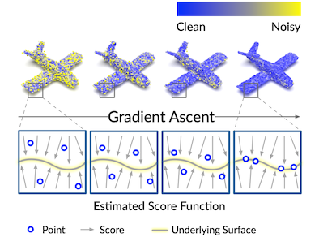

# Score-Based Point Cloud Denoising (ICCV'21)


[Paper] [https://arxiv.org/abs/2107.10981](https://arxiv.org/abs/2107.10981)

## Installation

### Recommended Environment

The code has been tested in the following environment:

| Package                                                      | Version | Comment                                                      |
| ------------------------------------------------------------ | ------- | ------------------------------------------------------------ |
| PyTorch                                                      | 1.9.0   |                                                              |
| [point_cloud_utils](https://github.com/fwilliams/point-cloud-utils) | 0.18.0  | For evaluation only. It loads meshes to compute point-to-mesh distances. |
| [pytorch3d](https://github.com/facebookresearch/pytorch3d)   | 0.5.0   | For evaluation only. It computes point-to-mesh distances.    |
| [pytorch-cluster](https://github.com/rusty1s/pytorch_cluster) | 1.5.9   | We only use `fps` (farthest point sampling) to merge denoised patches. |

### Install via Conda (PyTorch 1.9.0 + CUDA 11.1)

```bash
conda env create -f env.yml
conda activate score-denoise
```

### Install Manually

```bash
conda create --name score-denoise python=3.8
conda activate score-denoise

conda install pytorch==1.9.0 torchvision==0.10.0 cudatoolkit=11.1 -c pytorch -c nvidia

conda install -c conda-forge tqdm scipy scikit-learn pyyaml easydict tensorboard pandas

# point_cloud_utils
conda install -c conda-forge point_cloud_utils==0.18.0

# Pytorch3d
conda install -c fvcore -c iopath -c conda-forge fvcore iopath
conda install -c pytorch3d pytorch3d==0.5.0

# pytorch-scatter
conda install -c pyg pytorch-cluster==1.5.9
```

## Datasets

Download link: https://drive.google.com/drive/folders/1--MvLnP7dsBgBZiu46H0S32Y1eBa_j6P?usp=sharing

Please extract `data.zip` to `data` folder.

## Denoise

### Reproduce Paper Results

**[Known Issue about the PCNet Testset]** 
The P2M results of the PCNet testset might vary depending on GPU architecture and [PyTorch version](https://github.com/luost26/score-denoise/issues/12#issuecomment-1205965838). 
However, no matter how it varies, it remains strong linear correlation to the CD metric (see [discussion here](https://github.com/luost26/score-denoise/issues/12#issuecomment-1187022389)), so it does not affect the main result of this work.

```bash
# PUNet dataset, 10K Points
python test.py --dataset PUNet --resolution 10000_poisson --noise 0.01 --niters 1
python test.py --dataset PUNet --resolution 10000_poisson --noise 0.02 --niters 1
python test.py --dataset PUNet --resolution 10000_poisson --noise 0.03 --niters 2
# PUNet dataset, 50K Points
python test.py --dataset PUNet --resolution 50000_poisson --noise 0.01 --niters 1
python test.py --dataset PUNet --resolution 50000_poisson --noise 0.02 --niters 1
python test.py --dataset PUNet --resolution 50000_poisson --noise 0.03 --niters 2
```

### Denoise Regular-Size Point Clouds (≤ 50K Points)

```bash
python test_single.py --input_xyz <input_xyz_path> --output_xyz <output_xyz_path>
```

You may also barely run `python test_single.py` to see a quick example.

### Denoise Large Point Clouds (> 50K Points)

```bash
python test_large.py --input_xyz <input_xyz_path> --output_xyz <output_xyz_path>
```

You may also barely run `python test_large.py` to see a quick example.

## Train

```bash
python train.py
```

Please find tunable parameters in the script.

## Citation

```
@InProceedings{Luo_2021_ICCV,
    author    = {Luo, Shitong and Hu, Wei},
    title     = {Score-Based Point Cloud Denoising},
    booktitle = {Proceedings of the IEEE/CVF International Conference on Computer Vision (ICCV)},
    month     = {October},
    year      = {2021},
    pages     = {4583-4592}
}
```


